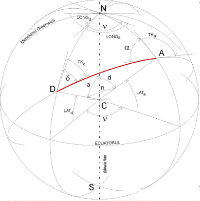
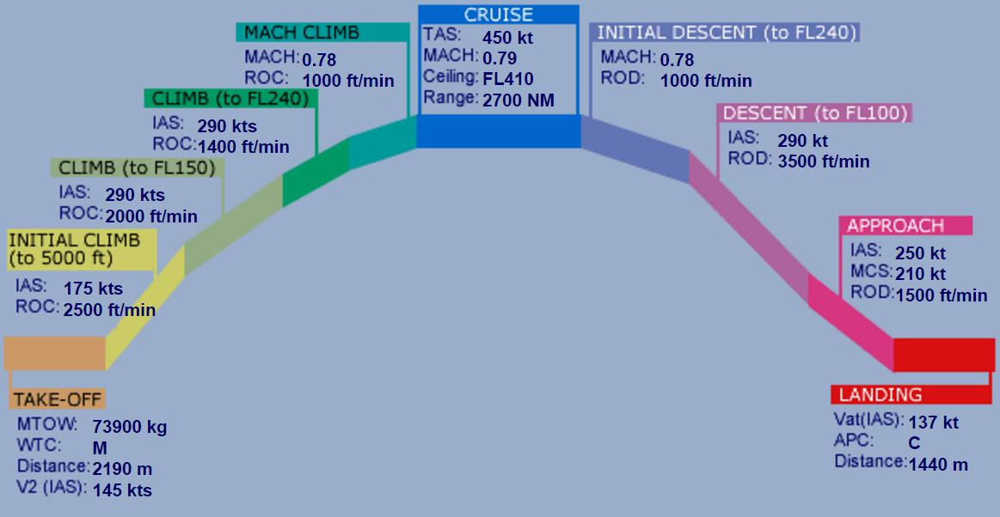
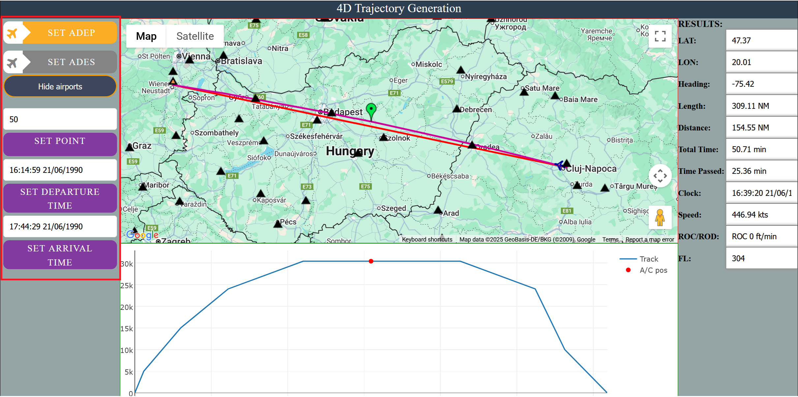
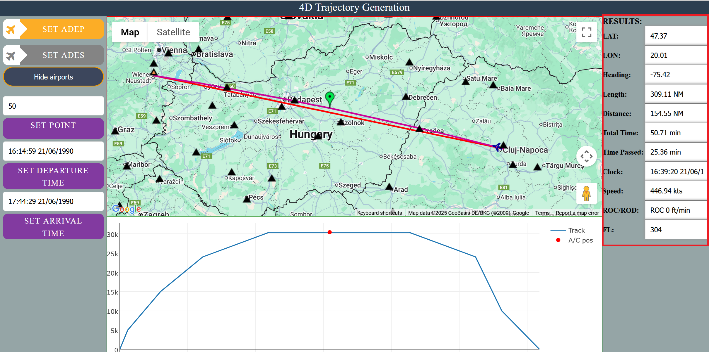

# 4D-Trajectory-Generation

Tool for generation and visualization of 4D trajectories (latitude, longitude, altitude, speed) between any two airports in the world. Based on the performance model of an Airbus A320 (variable speeds and vertical rates of change), and the orthodromic distance between the airports, an optimal cruise flight level is determined and the flight profile is then generated.

## Trajectory 

The horizontal part of the trajectory is generated as an orthodrome between the two airports. An orthodrome is the shortest distance between two points on a sphere, also known as a Great Circle.





The vertical profile is generated using the performance model of an Airbus A320. Using the orthodromic distance between the chosen airports and assuming a minimum cruise time of 15 minutes an optimal cruise level is then determined together with the variable speeds and vertical rates of change for each leg of the flight profile.   




## How to use it 
First you must have a google maps api key, and place it in src/config/config.js.
If the file does not exist you can create it.
Inside you must have the following code, just like in config.example.js.
```javascript
const GOOGLE_MAPS_KEY = "YOUR_API_KEY"; //replace YOUR_API_KEY with your actual API key
```
The api key must have "Maps JavaScript API" enabled.

To do so, go to https://console.cloud.google.com/.
Then scroll down and under "Quick Access" select "APIs & Services".
Then from the left sidebar select "Enabled APIs & services".
Then click on "+ Enable APIs and services" at the top.
From there search "Maps JavaScript API" and enable it.
Or click on "Manage", search for "Maps JavaScript API" again and click the enable button.

### Inputs 



* SET ADEP - set the departure airport when the button is active by clicking on one of the triangles on the map representing an airport
* SET ADES - set the arrival airport when the button is active by clicking on one of the triangles on the map representing an airport
* Hide Airports/Display airports - button that can be used to highlight or not the airports
* SET point - by inputting a value between 0 and 100 or by moving the green marker a point along the trajectory is chosen for which the                  results are displayed
* SET DEPARTURE TIME - set the desired date and time for departure. If this feature is selected the arrival time is automatically                                  calculated.
* SET ARRIVAL TIME - set the desired date and time for of arrival. If this feature is selected the arrival time is automatically                                    calculated

### Results  



* LAT - latitude of the selected point along the trajectory 
* LONG - longitude of the selected point along the trajectory
* Heading - aircraft's heading 
* Length - length of the orthodrome distance between the two airports (unit of measure: nautical miles)
* Distance - distance up to the selected point along the trajectory (unit of measure: nautical miles)
* Total time - total duration of the flight 
* Time passed - time passed from departure up to the selected point along the trajectory 
* Clock - date and time at the selected point along the trajectory 
* Speed - speed of the aircraft at the selected point (unit of measure: knots)
* ROC - rate of climb of the aircraft at the selected point along the trajectory (unit of measure: feet/minutes)
* FL - flight level of the aircraft at the selected point along the trajectory (unit of mesure: hundreds of feet)

## Authors 
* Alexa Radu 
* Danciu Bogdan 


